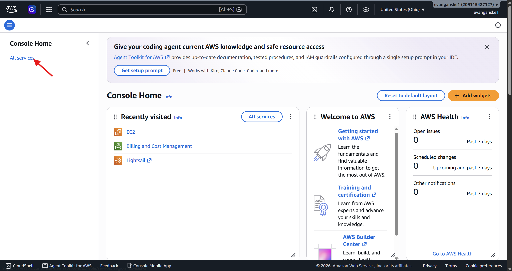
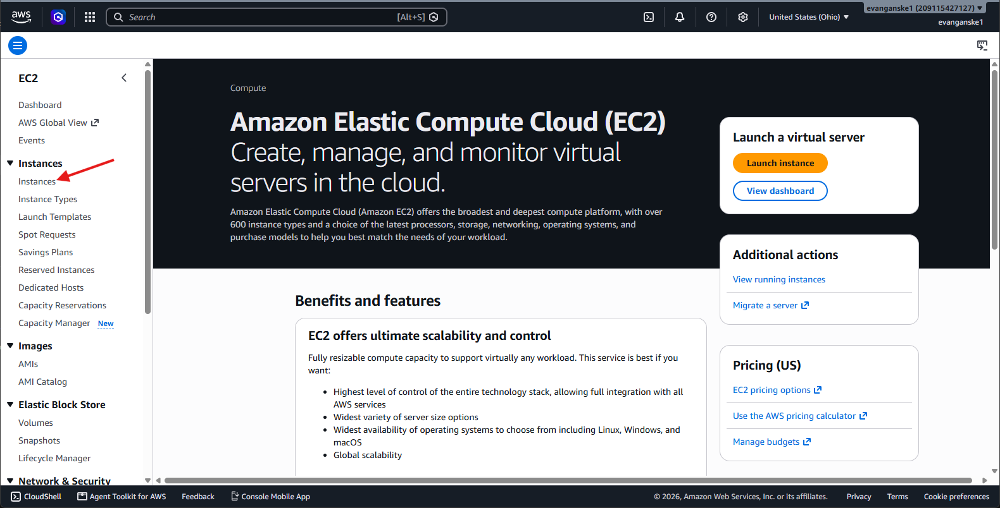
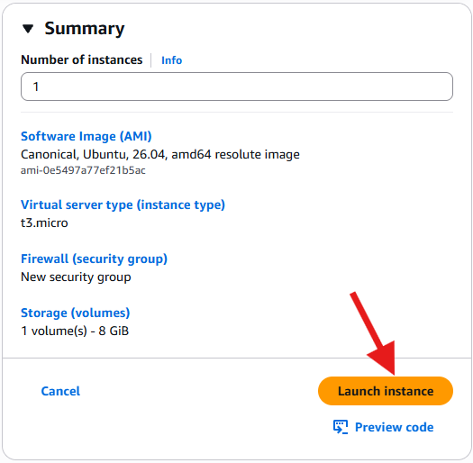
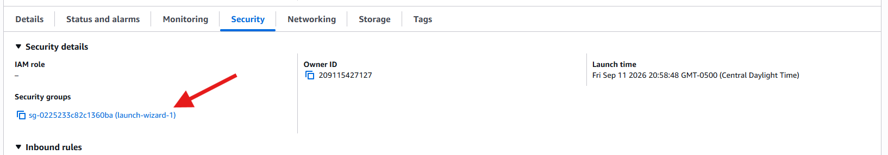
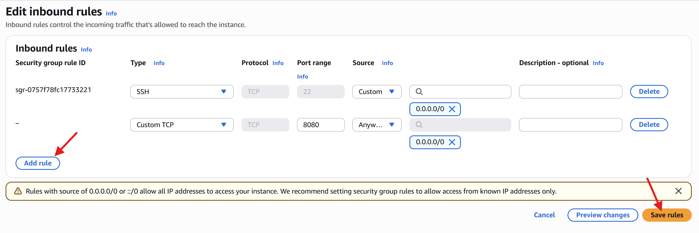

# Recreating Container Instances

This documentation will go through the steps necessary to recreate container instances for a set of static websites.

## Static websites and GitHub

This documentation is not primarily concerned with the process of creating static websites;
it is focused on how to serve them in a container.
With that goal in mind, you should create six unique static sites using HTML, CSS,
and JavaScript before you begin working with containers.
Generative AI is a good tool to use when building simple sites for this goal.

Your repository structure should look similar to this once you have finished creating your site files:

```text
project-root/
├── 📁 static-site-1/
│   ├── 📄 index.html
│   ├── 📁 css
│   │   └── 📄 style.html
│   └── 📁 js
│       └── 📄 main.js
├── 📁 static-site-2/
├── 📁 static-site-3/
├── 📁 static-site-4/
├── 📁 static-site-5/
└── 📁 static-site-6/
```

This repository should be committed to a remote GitHub repository so that you can pull these files onto your Ubuntu server instance later.

## Create an Ubuntu instance

1. Navigate to the [AWS Management Console](https://console.aws.amazon.com/).
Sign in or create an account to enter the management console.

2. Click on "All Services" on the left navigaton panel.

    

3. Under the *Compute* category of services, select **EC2**.

4. On the left panel, select **Instances**.

    

5. Click "Launch Instances" in the upper right-hand corner.

6. Name the instance. A good choice is "Ubuntu_Server-Containers".

7. Select Ubuntu as the Amazon Machine Image (AMI).

8. In the "Key pair (login)" card, click to **Create a new key pair**.
It can be named something similar to "Ubuntu-containers-key".
Once the key has been created, make sure you know where you can access it.
One place is to leave it is in the same repository as your static sites,
but make sure to add a .gitignore so that the key is not committed to GitHub.

9. Ensure your summary card shows the correct AMI to launch. Launch the instance.

    

10. Once you have made it to the instance dashboard,
you need to set up the security settings to enable incoming TCP requests.
Start by navigating to the security tab and clicking on the security groups link.

    

    Next, click to **Edit inbound rules** on the right side of your screen.
    There should already be a rule allowing incoming SSH connections.
    Add a new *Custom TCP* rule that allows incoming connections from any IPv4 address on port 8080.

    

10. You can now use the "Connect" button on the top right of your screen to connect to your Ubuntu machine via SSH.
